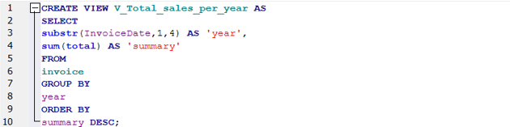

# SQL-queries-database-analysis
prepared some SQL queries to analyse the Chinook database

This repository contains a modified version of the database with SQL queries (as views in the file). I’ve asked some questions and prepared answers based on SQL queries. I present how we can prepare data with values of total sales per year. In the next query you can see how to check how long have the employees been working at this company (months included). Other queries are the analysis which show us tracks that are not sold. You can see the list of all of them, the number of those tracks. You can compare the total number of all tracks and number of tracks which are sold. Please find the details below. The results of queries you can find in the attached file.

Query 1 Total sales per year
How did the total sales volume evolve over the years, starting with the sum of highest total value?
## Query1 
Query 2 Length of employment
How long have the employees been working at this company? Months are considered. At the top a person who has been working the longest.

Query 3 Tracs that do not sell

Query 4a The number of tracks that are sold

Query 4b The number of all tracks in the database

Query 4c The number of tracks that are not sold

This project is based on the Chinook database. Source: https://github.com/lerocha/chinook-database
